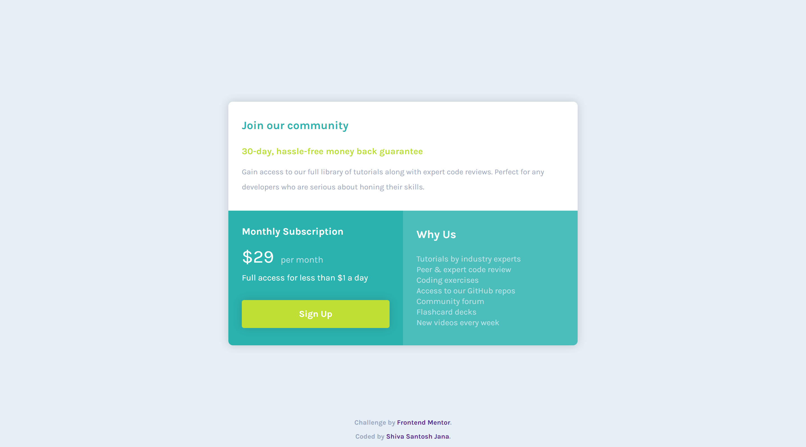

# Frontend Mentor - Single price grid component solution

This is a solution to the [Single price grid component challenge on Frontend Mentor](https://www.frontendmentor.io/challenges/single-price-grid-component-5ce41129d0ff452fec5abbbc). Frontend Mentor challenges help you improve your coding skills by building realistic projects.

## Table of contents

- [Overview](#overview)
  - [The challenge](#the-challenge)
  - [Screenshots](#screenshots)
  - [Links](#links)
- [My process](#my-process)
  - [Built with](#built-with)
  - [What I learned](#what-i-learned)
  - [Continued development](#continued-development)
- [Author](#author)

## Overview

### The challenge

Users should be able to:

- View the optimal layout for the component depending on their device's screen size
- See a hover state on desktop for the Sign Up call-to-action

### Screenshot

Desktop version

Mobile version

### Links

- Solution URL: [Code on GitHub](https://github.com/santu369/frontendmentor-single-price-grid-component)
- Live Site URL: [GitHub Pages Live URL](https://santu369.github.io/frontendmentor-single-price-grid-component/dist)

## My process

Experimented with css reset. Worked on mobile layout first and expanded it to desktop layout with a couple of grid styles.

### Built with

- Semantic HTML5 markup
- CSS custom properties
- Flexbox
- CSS Grid
- Mobile-first workflow
- BEM Methodology
- SASS
- Parcel

### What I learned

Experimented with css normalize. It makes browsers render elements on the page more consistently rather tn stripping away all the styles like css reset. CSS reset provides much more control on the styling part but everything will have to be written in css whereas normalize makes all browsers render an element with same styling but these will have some padding/margin. If any developer wants to have custome padding/margin, css should be written for those.
I see using reset works fine in these cases.
Used Parcel V2, which is still in beta. Parcel Bundler which was the V1 is no longer maintained.

### Continued development

Will check on browsersync and webpack going forward and also start using bootstrap.

### Useful resources

- [Sass](https://sass-lang.com/) - Installing and Learning Sass.
- [BEM](https://en.bem.info/methodology/quick-start/) - Quick Start with BEM.
- [W3C Markup Validation Service](https://validator.w3.org/) - Validator for checking the markup validity of Web documents in HTML, XHTML, SMIL, MathML, etc.
- [W3C CSS Validation Service](https://jigsaw.w3.org/css-validator/) - Check Cascading Style Sheets (CSS) and (X)HTML documents with style sheets.
- [PerfectPixel by WellDoneCode](https://www.welldonecode.com/perfectpixel/) - Extension helps to develop websites with pixel perfect accuracy based on design pictures.
- [Parcel Bundler](https://parceljs.org/getting_started.html) - Getting started with parcel bundler V1.
- [Reset CSS](https://meyerweb.com/eric/tools/css/reset/) - Strips away all the default browser styling.
- [Normalize CSS](https://necolas.github.io/normalize.css/) - Makes browsers render all elements more consistently and in line with modern standards. It precisely targets only the styles that need normalizing..
- [Parcel](https://v2.parceljs.org/) - Getting started with Parcel V2

## Author

- Website - [Shiva Santosh Jana](https://santu369.github.io/FreeCodeCamp-PersonalPortfolioWebpage)
- Frontend Mentor - [@santu369](https://www.frontendmentor.io/profile/santu369)
- Twitter - [@santu69](https://www.twitter.com/santu69)
